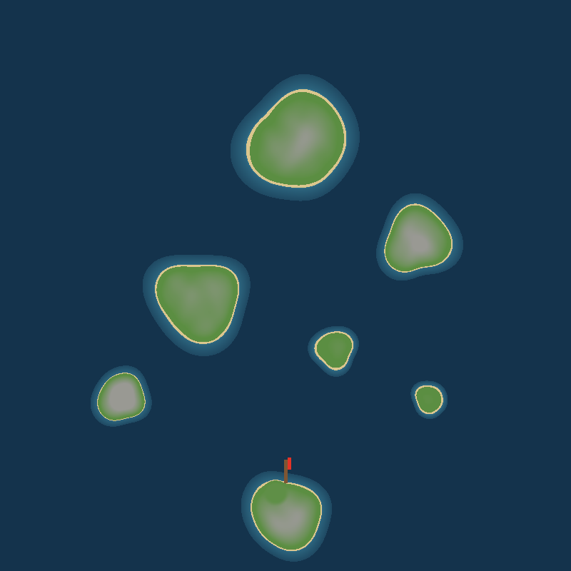

# Odin's Coin

Et 3D vikingspill i Unity: seil langskipet, raid øyer og kast **Odins mynt** om bord for flaks, eller ulykke.

- Design: [DESIGN.md](DESIGN.md)
- Plan: [ROADMAP.md](ROADMAP.md)

## Kom i gang

1. Lag et nytt **Universal 3D**-prosjekt i Unity Hub (Unity 6 eller 2022.3 LTS).
2. Kopier `OdinsCoin/Assets/Scripts` inn i `Assets/`-mappen i prosjektet.
3. Åpne `SampleScene` og trykk **Play**. Alt bygges fra kode, også lyden.
4. Velg **New voyage** på tittelskjermen. Senere velger du **Continue**, for spillet lagres automatisk.

## Kontroller

| Tast | Hva |
|---|---|
| WASD | gå (i førsteperson også sidelengs og baklengs) |
| Shift / Space | løpe / hoppe (løping tar pust) |
| W mot en klippe | klatre så lenge pusten varer |
| Mus | se rundt (du ser ut gjennom heltens øyne, med sikte midt på skjermen) |
| V | bytte mellom førsteperson og tredjeperson (i tredjeperson zoomer scroll) |
| Venstre / høyre mus | øks / skjold |
| E | bruke: ta roret, alteret, plukke opp og sette ned kister, selge, øse og tette hull, klatre om bord |
| Ved roret | A/D styre, W mer fart og S mindre: stopp, ro, halvt seil, fullt seil. Stoppet fortøyer eller ankrer hun selv. Ligger vinden rett imot, ror mannskapet. |
| E ved en runering | rør steinene i rekkefølge etter hakkene for å vekke ringen og få gaven |
| E ved en innbygger | hør et rykte om hvor det er noe å finne |
| E ved en varde | grave opp en nedgravd skatt (skattekart i plyndrede kister viser hvor) |
| E ved et landemerke | klatre opp og se utover: området rundt tegnes inn på sjøkartet |
| E ved alteret om bord | sats kista du bærer (dobbelt eller ingenting), eller trykk to ganger for å satse alt på dekk |
| F | når Odins gunst er full: ved alteret kommer Munin (neste satsing vinner), ellers viser Hugin vei til de nærmeste skattene |
| Esc | meny (pause, innstillinger, lagre og avslutte) |

## Spillet i korte trekk

- **Hjemmefjorden:** Den er trygg. Gunnar på brygga kjøper kister. Bjørn ved methallen selger oppgraderinger (seil, årer, skrog, brynje, øks) og spiller terning.
- **Odins alter** om bord: sats skatten. Kron løfter kista ett trinn (vanlig, sølv, gull, Odins skatt), og hvert trinn dobler verdien. Mynt betyr at Odin tar den. Du kan også satse alt på dekk i ett kast.
- **Oddsen:** Den står alltid på skjermen: 50 % som standard, litt bedre for hver Lykkens rune du vekker i en runering (høyst 60 %).
- **Odins gunst og ravnene:** Når gunsten er full, trykker du F. Ved alteret kommer Munin, og da vinner neste satsing. Ellers flyr Hugin ut og sirkler over de nærmeste skattene.
- **Å utforske:** landemerker, utsiktspunkter, runeringer, nedgravde skatter med kart, grotter med draugar og tre ravnefjær gjemt rundt hvert sted. Spør folk i byene hva som er nytt.
- **Farer på havet:** stormer (øs vann), danske vikingskip (ram dem) og Jormungand (hugg den i hodet mens den er bedøvet).
- Kun spillgull. Aldri ekte penger.

## Verden

Seks øyer, blant annet to med kloster (Lindholm og Iona Minor), og hjemmeøya i sør. Den brune streken er brygga, og den røde viser hvor skipet ligger fortøyd.

Alle lydene er generert i kode, og du kan høre dem i [docs/sounds](docs/sounds).

## Testing uten Unity

- `tools/check.sh` kompilerer alt mot en falsk Unity-API, både for Unity 2022 og Unity 6.
- `tools/tests/run.sh` kjører logikktestene.
- `tools/preview/render.sh` tegner kartet og lager WAV-filer av lydene.
