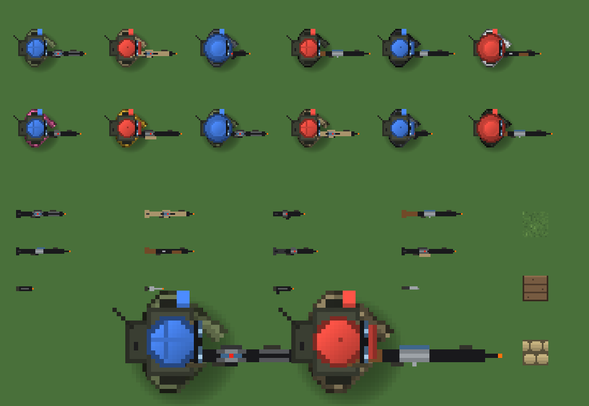
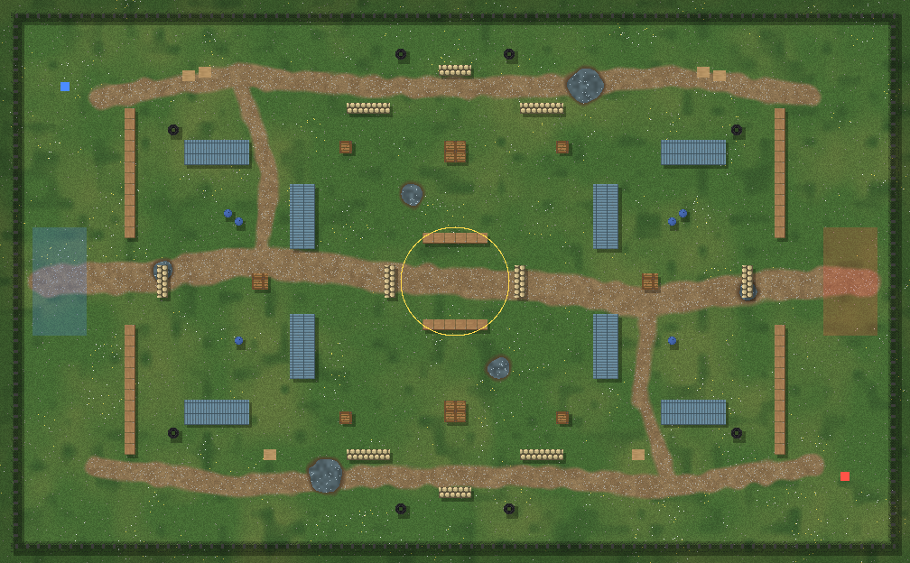
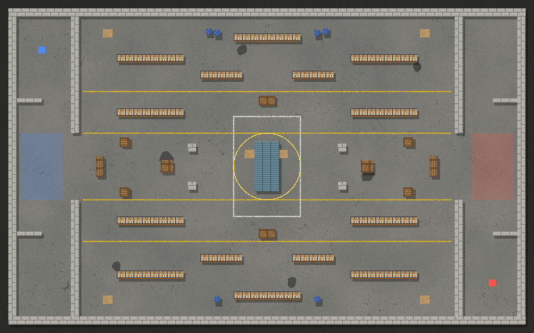
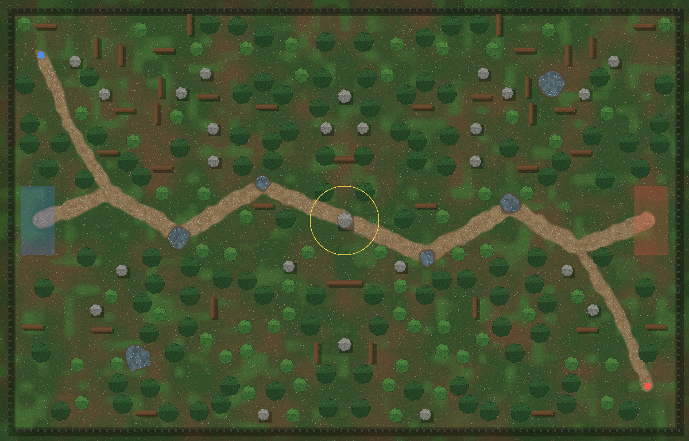
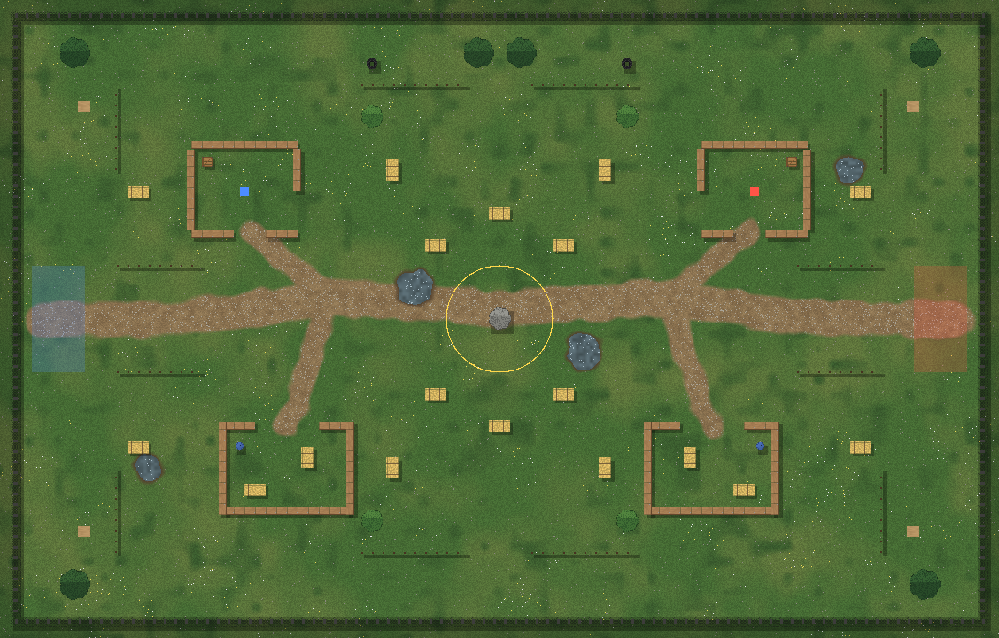
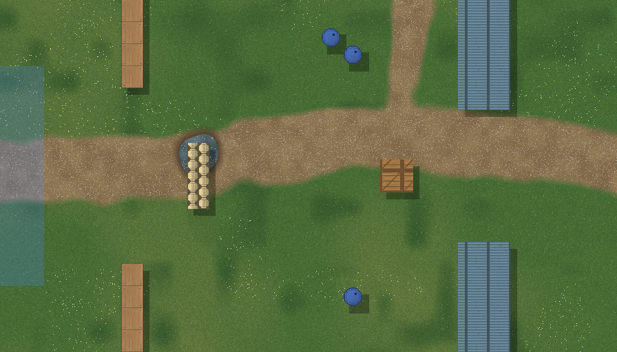
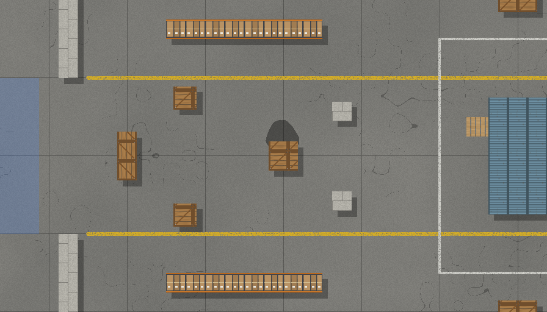

# Airsoft Arena

Et airsoft-spill ovenfra i 2D pixel-stil, laget i Unity. Målet er Steam.
Denne mappen inneholder den første spillbare prototypen: Team Deathmatch 4v4 mot bots, med dommersystem.

## Kom i gang (5 minutter)

1. Åpne **Unity Hub** og velg **New project**. Velg malen **Universal 2D** (Unity 6 eller 2022.3 LTS).
2. Kopier mappen `AirsoftArena/Assets/Scripts` fra dette repoet inn i `Assets/`-mappen i det nye prosjektet.
3. Åpne `SampleScene` (eller en hvilken som helst tom scene) og trykk **Play**.

Spillet bygger alt selv fra kode: kart, grafikk, lobby og kamp. Du trenger ingen prefabs, scener eller bilder.
Koden virker med både det gamle Input Manager og det nye Input System.

## Kontroller

| Tast | Handling |
|---|---|
| WASD | Gå |
| Mus | Sikte |
| Venstre museknapp | Skyte (eller dømme som dommer) |
| R | Lade om |
| B | Bytte skytemodus (semi / burst / auto) |
| 1 / 2 / 3 | Primærvåpen / pistol / kniv |
| C eller Ctrl | Huke (mindre spredning, vanskeligere å treffe bak dekning) |
| Shift | Sprinte (kan ikke skyte) |
| **H** | **Rope "HIT!"** |
| Esc | Pause |

## Hva som er med

- **BB-fysikk:** Hver BB har fart, luftmotstand, hop-up, fall og vind. Lave sandsekker stopper bare BB-er som flyr lavt, så det hjelper å huke bak dekning. Tunge BB-er driver mindre i vinden.
- **"Call your hit":** Blir du truffet, har du 2,5 sekunder på å trykke H. Gjør du det ikke, spiller du videre som "zombie", men dommeren kan ta deg. Da får motstanderlaget et ekstra straffepoeng, og du får bot og lavere honor.
- **Leie dommer:** Før kampen velger du en dommer. Alle spillerne betaler honoraret. Dommere med flere stjerner koster mer og er bedre til å oppdage juks. Billige dommere overser juksere og kan dømme feil.
- **Jobbe som dommer:** Du går rundt på banen og klikker på spillere som ble truffet uten å løfte den oransje filla. Spillerne rater deg etter kampen, og flere stjerner gir høyere honorar.
- **Våpenklasser 00–07** med fiktive navn og koder (f.eks. `01-VK4 Viking K4`), drivsystemene AEG, gass, CO2 og fjær, og stats for FPS, RPM, magasin og omladingstid.
- **Profil:** penger (bare i spillet), skill-rating, honor og dommer-rating. Alt lagres mellom øktene.
- **Bots:** Noen er ærlige, andre jukser. Friendly fire teller som treff, men gir ikke poeng.

## Mappestruktur

```
AirsoftArena/Assets/Scripts/
  Core/      Oppstart, input, pixel-grafikk, kart, kamera, effekter
  Weapons/   Våpendata (ScriptableObject), våpenliste, ammo/omlading, BB-fysikk
  Actors/    Soldat (alle regler), spillerkontroll, bot-AI, lag
  Referee/   Dommerprofil og -marked, dommer på banen, dommer spilt av deg
  Match/     Kampforløp, poeng, dommeravgjørelser, utbetaling
  Economy/   Spillerprofil og lagring
  UI/        Lobby, HUD og resultatskjerm
```

Reglene (våpen, treff, dommer og økonomi) er holdt adskilt fra grafikken, så de kan gjenbrukes i 3D-versjonen senere.
Se [`AirsoftArena/DESIGN.md`](AirsoftArena/DESIGN.md) for designbeslutninger og veien videre.

## Verktøy (uten Unity)

- `tools/check.sh` kompilerer alle scriptene mot en liten falsk Unity-API. Det fanger skrivefeil, men beviser ikke at spillet kjører.
- `tools/preview/render.sh` tegner all generert pixel-art til `AirsoftArena/docs/sprites.png`.
- `tools/tests/run.sh` kjører logikktester (kosmetikk, våpen, økonomi) uten Unity.
- Alle lydeffektene lages i koden. `AirsoftArena/docs/sounds/` har WAV-kopier du kan høre på.



| Pallet Yard (80×48 m) | Warehouse, innendørs (60×36 m) |
|---|---|
|  |  |
| **Forest (96×60 m)** | **Old Farm (90×56 m)** |
|  |  |

Nærbilder i full oppløsning (32 px per meter):



