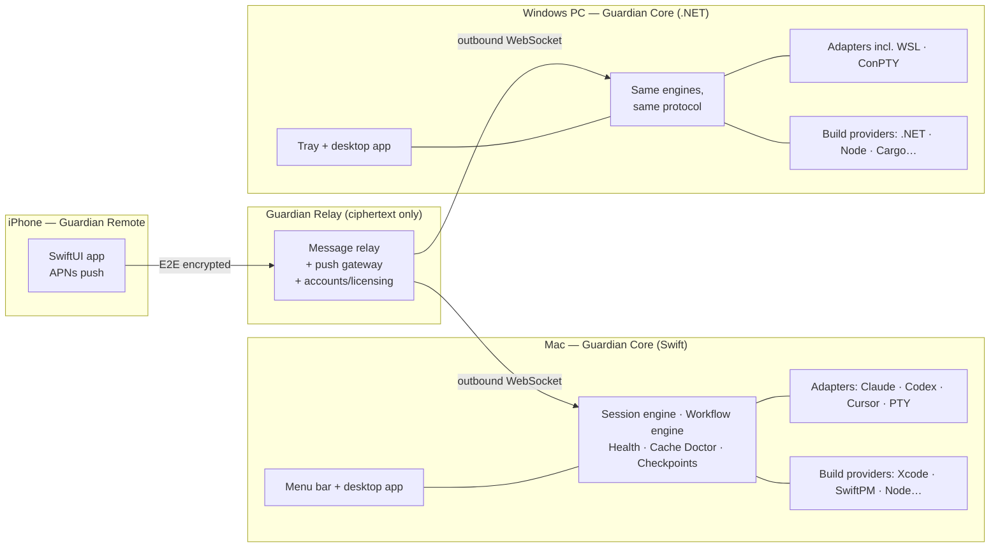
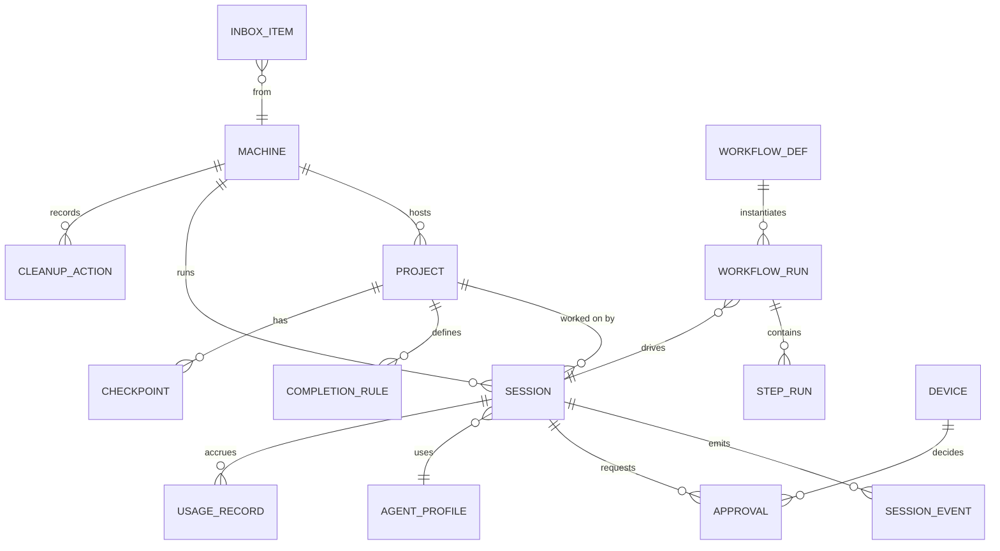
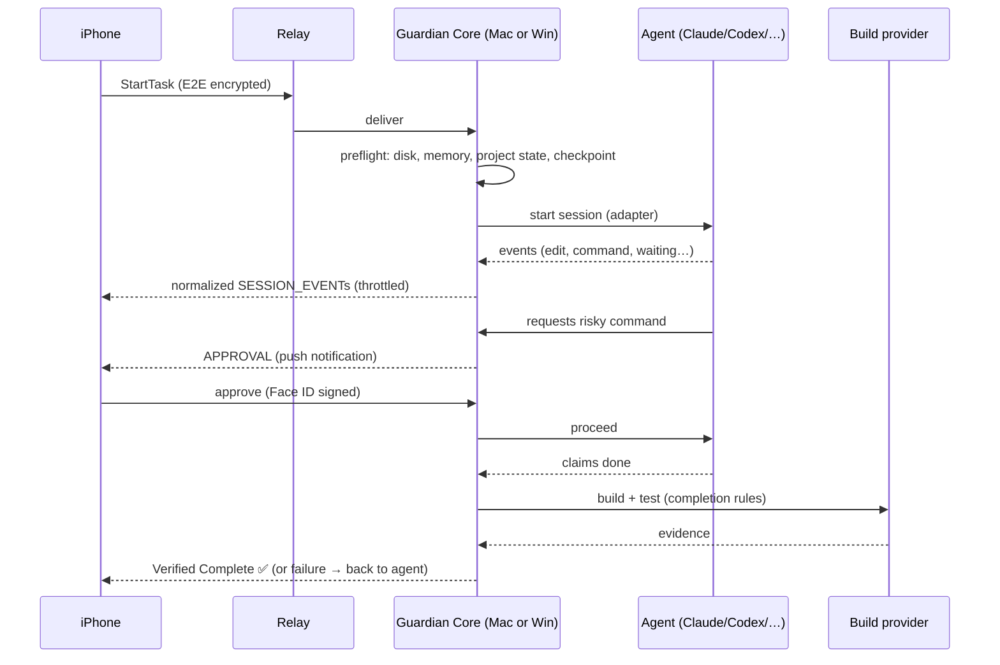
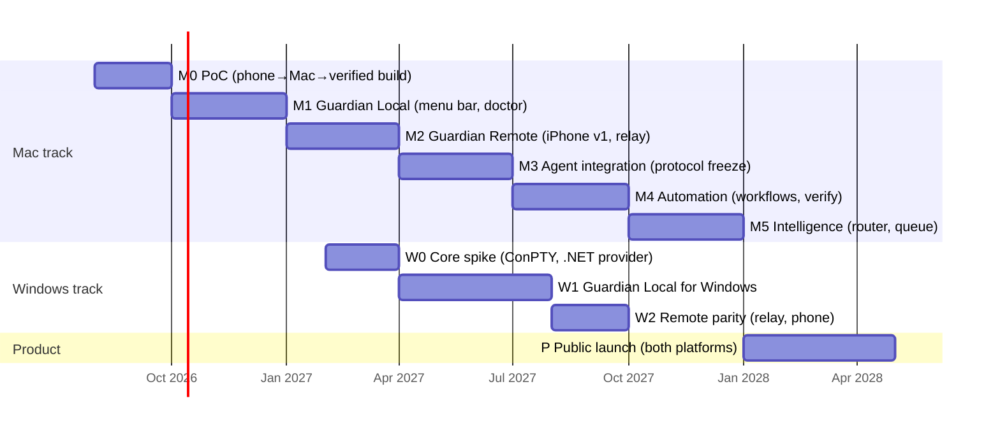

# Guardian — The Grand Plan

**Mac + Windows + iPhone. One supervisor for every development machine.**

> **The product promise:** Start work from anywhere. Guardian keeps your development machines, agents and development process running until the task is truly finished — whether the machine is a Mac or a Windows PC.

This document supersedes and extends the original Mac-only plan
([`mac-guardian-product-plan.md`](./mac-guardian-product-plan.md)). Everything in the
original plan still applies to the Mac; this plan generalizes it to Windows, defines
how the iPhone and desktop apps will look screen by screen, and lays out a concrete
implementation playbook for getting each feature into the app.

## Table of contents

1. [Vision](#1-vision)
2. [Product family and naming](#2-product-family-and-naming)
3. [Platform strategy — one product, two desktop platforms](#3-platform-strategy--one-product-two-desktop-platforms)
4. [The grand feature set](#4-the-grand-feature-set)
5. [Generalizing the Mac-only concepts](#5-generalizing-the-mac-only-concepts)
6. [The iPhone app — screen by screen](#6-the-iphone-app--screen-by-screen)
7. [The Mac app — screen by screen](#7-the-mac-app--screen-by-screen)
8. [The Windows app — screen by screen](#8-the-windows-app--screen-by-screen)
9. [System architecture](#9-system-architecture)
10. [Implementation playbook — how each feature gets into the app](#10-implementation-playbook--how-each-feature-gets-into-the-app)
11. [Roadmap — two tracks, one protocol](#11-roadmap--two-tracks-one-protocol)
12. [Business model](#12-business-model)
13. [Risks and open questions](#13-risks-and-open-questions)
14. [Decisions to make next](#14-decisions-to-make-next)

---

## 1. Vision

The original insight does not change: remote chat with an agent will be copied by every
provider. The defensible product is a **provider-independent supervisor that keeps the
whole development machine and workflow working correctly**.

Going cross-platform strengthens that insight instead of diluting it:

- A developer with a MacBook and a Windows desktop gets **one Inbox, one Work Queue,
  one phone app** for both machines.
- Provider independence (Claude, Codex, Cursor, generic terminal) now pairs with
  **machine independence** (macOS, Windows).
- The long-term shape is a **dev fleet supervisor**: tasks routed to whichever machine
  holds the project, with the phone as the single remote control.

What Guardian is **not**: another AI model, another IDE, another basic remote terminal,
and not a cloud CI service. Everything runs on the user's own machines; Guardian
supervises.

---

## 2. Product family and naming

"Mac Guardian" no longer fits a product that also runs on Windows. Working proposal:
the family is simply **Guardian** (final name pending a trademark/App Store check —
see [open questions](#13-risks-and-open-questions)).

| Component | What it is | Platform |
|---|---|---|
| **Guardian Core** | Background service: process supervision, sessions, workflows, health, storage, relay connection | macOS (Swift), Windows (.NET) |
| **Guardian for Mac** | Menu bar app + full desktop app | macOS |
| **Guardian for Windows** | System tray app + full desktop app | Windows 11 (10 22H2 minimum) |
| **Guardian Remote** | The phone remote control | iOS (Android is explicitly out of scope until after Phase W2) |
| **Guardian Relay** | Cloud relay for phone ↔ machine messages. Sees only ciphertext | Hosted service |
| **Guardian Protocol** | Versioned, documented message/data schema everything speaks | Specification, not code |

The **Guardian Protocol** is the load-bearing element of the whole cross-platform
plan: it is what lets a Swift Mac core, a .NET Windows core and a SwiftUI iPhone app
behave as one product. It is defined before the Windows port starts (Section 3).

---

## 3. Platform strategy — one product, two desktop platforms

### The options considered

| | A. Two native cores + shared protocol | B. Shared Rust core + native shells | C. Electron/Tauri cross-platform app |
|---|---|---|---|
| macOS stack | Swift/SwiftUI (as originally planned) | Rust core via UniFFI + SwiftUI shell | Web UI + node/rust helper |
| Windows stack | C#/.NET 8 + WinUI 3 | Rust core via C ABI + WinUI 3 shell | Same web UI |
| Time to Mac Phase 0 | **Fastest** — no new toolchain | Slow — core extraction first | Medium |
| Long-term drift risk | Highest — two implementations of workflow engine, stuck detection, protocol | **Lowest** — one core | Low for UI, high for OS integration |
| OS integration quality (launchd, ConPTY, Keychain/DPAPI, power, notifications) | **Best** — fully native both sides | Good (shells are native) | Worst — the product *is* OS integration |
| Solo/small-team maintenance | Two codebases, one spec | Three languages (Rust + Swift + C#) but one brain | One codebase, wrong tool |

### The decision

**Start with Option A, engineered so that Option B remains open.** Concretely:

1. **Mac ships first in pure Swift**, exactly as the original plan says. No new
   toolchain stands between now and Phase 0.
2. From day one, the platform-neutral logic — session state machine, workflow engine,
   stuck-detection rules, event model, relay protocol — lives in **separate Swift
   packages with zero AppKit/platform imports**, tested against **shared JSON test
   vectors** stored in the repo.
3. The **Guardian Protocol v1 is frozen at the end of Phase 3** (agent integration).
   Every message, entity and state transition is documented JSON with a schema.
4. The **Windows core is written in C#/.NET against the protocol spec and must pass
   the same test vectors**. The test vectors — not shared code — are what keep the
   two cores honest.
5. If the two cores drift painfully after Windows ships, extract a Rust core then
   (Option B), with the protocol and test vectors making the extraction mechanical.

Why not Electron/Tauri: Guardian's entire value is deep OS integration — process
supervision, PTYs, power management, credential storage, native notifications. A web
shell fights the product at every step. Native UI is also lightweight here because the
UI is mostly lists, statuses and forms; the hard part is the core, which is native
either way.

### What is shared, concretely

| Artifact | Form | Used by |
|---|---|---|
| Guardian Protocol spec | Markdown + JSON Schema, versioned | All components |
| Test vectors | JSON files: session transcripts → expected events/states | Mac core CI, Windows core CI |
| Workflow definitions | YAML/JSON documents | Both cores execute them identically |
| Relay crypto design | Spec + reference vectors (X25519/XChaCha20-Poly1305) | Mac, Windows, iOS |
| Design language tokens | Colors, iconography, status vocabulary | All three UIs |

---

## 4. The grand feature set

Consolidated from the original plan plus the cross-platform additions.
**Phase** refers to the roadmap in Section 11 (M = Mac track, W = Windows track).

### Supervision and sessions

| Feature | macOS | Windows | iPhone role | Phase |
|---|---|---|---|---|
| Project registry (paths, repos, build/test commands, agents, rules) | ✅ | ✅ | Browse, pick | M1 / W1 |
| Session engine with 14 statuses (Ready…Offline) | ✅ | ✅ | View, control | M1 / W1 |
| Agent adapters: Claude, Codex, Cursor, Generic Terminal | ✅ | ✅ (incl. WSL) | — | M3 / W1 |
| Event extraction ("Claude is editing CalendarView.swift") | ✅ | ✅ | Feed display | M3 / W1 |
| Stuck detection + Loop Guard | ✅ | ✅ | Alert, decide | M4 / W1 |
| Crash/restart recovery, Guardian Replay | ✅ | ✅ | Notified | M1/M4 / W1 |
| Emergency Stop | ✅ | ✅ | **Trigger** | M2 / W2 |

### Build and machine health

| Feature | macOS | Windows | iPhone role | Phase |
|---|---|---|---|---|
| Build Providers (see §5) | Xcode, SwiftPM, generic | .NET/MSBuild, Node, Cargo, Gradle, CMake, generic | View results | M1 / W1 |
| Cache Doctor, 4 levels + learning | DerivedData, SPM, simulators… | NuGet, obj/bin, .vs, npm, Gradle, WSL vhdx… | Approve cleanups | M1/M4 / W1 |
| Health monitoring (memory, CPU, disk, thermal, network) | ✅ | ✅ | Dashboard | M1 / W1 |
| Keep-awake during supervised work | IOPMAssertion | SetThreadExecutionState | Toggle | M1 / W1 |
| Environment Doctor | Xcode/simulators/runtimes | VS Build Tools/SDKs/WSL | View report | M4 / W1 |

### Remote and automation

| Feature | macOS | Windows | iPhone role | Phase |
|---|---|---|---|---|
| QR pairing + E2E encrypted relay | ✅ | ✅ | ✅ | M2 / W2 |
| Start task from phone (typed or spoken) | executes | executes | **Primary UI** | M2 / W2 |
| Inbox (approvals, failures, stuck, limits, completions, offline) | feeds | feeds | **Primary UI** | M2 / W2 |
| Remote approvals; Face ID for dangerous actions | executes | executes | **Primary UI** | M2 / W2 |
| Workflow engine (Implement Feature, Fix Build, Night Shift, Handoff, Release) | ✅ | ✅ (Release = platform-specific) | Launch, monitor | M4 / W2 |
| Proof of completion / Verified Complete | ✅ | ✅ | Evidence view | M4 / W2 |
| Prompt preparation (opt-in, never silently) | ✅ | ✅ | Review diff | M5 |
| Model & agent router with explanations | ✅ | ✅ | Set rules | M5 |
| Rate-limit queue and resume | ✅ | ✅ | Notified | M3 / W2 |
| Work Queue (day-long task list) | ✅ | ✅ | **Primary UI** | M5 |
| Remote Bug Drop (screenshot + voice → task) | executes | executes | **Primary UI** | M4 |
| Morning Report | ✅ | ✅ | Reader | M4 |
| Project Time Machine (checkpoint + one-tap rollback) | ✅ | ✅ | Rollback button | M4 / W2 |
| Plugin/MCP manager + packs | iOS/Web/GitHub packs | Web/.NET/GitHub packs | View, approve | M5 |
| Multi-machine routing (task → machine that has the project) | ✅ | ✅ | Machine picker / auto | M6 |
| Agent Referee, Focus Mode | ✅ | ✅ | Decide | M6 |

---

## 5. Generalizing the Mac-only concepts

The original plan is full of Xcode- and macOS-specific machinery. Each piece becomes a
**pluggable provider behind a protocol interface**, with the Mac implementation as the
first provider — not a special case.

### 5.1 Build Providers (was: Guardian Build Engine)

The Build Engine becomes a registry of Build Providers. Each provider implements:
`detect(projectFolder)`, `listTargets()`, `build()`, `test()`, `parseDiagnostics(log)`,
`estimateCleanImpact()`.

| Provider | Platforms | Detects | Builds with | Diagnostics parsed |
|---|---|---|---|---|
| **Xcode** | macOS only | `.xcodeproj` / `.xcworkspace` | `xcodebuild` (schemes, destinations, archives) | Swift/Clang errors, xcresult |
| **SwiftPM** | macOS (Windows later) | `Package.swift` | `swift build` / `swift test` | Swift errors |
| **.NET / MSBuild** | Windows first, macOS possible | `.sln` / `.csproj` | `dotnet build/test`, `MSBuild.exe` | CS/MSB codes, TRX test results |
| **Node** | both | `package.json` | configured scripts (`npm run build`, `test`) | tsc/eslint/jest output |
| **Cargo** | both | `Cargo.toml` | `cargo build/test` | rustc JSON diagnostics |
| **Gradle** | both | `build.gradle(.kts)` | `gradlew build/test` | Gradle/Kotlin/Java errors |
| **CMake** | both | `CMakeLists.txt` | `cmake --build` + ctest | compiler output |
| **Generic** | both | user-configured | any command | exit code + regex rules |

Important asymmetry to state honestly in the product: **Windows cannot build iOS/macOS
apps.** A SangBoken task must run on a Mac. This is exactly what makes multi-machine
routing (Phase 6) valuable: from the phone you pick the *project*, and Guardian routes
to the machine that can build it.

### 5.2 Cache Doctor per platform

Same four levels (Diagnose → Clean current build → Clean project caches → Developer
storage cleanup), same smart rules, same cache learning. Only the **category catalog**
is per-platform:

| Category | macOS | Windows | Auto-deletable? |
|---|---|---|---|
| Per-project build products | DerivedData/<project> | `obj/`, `bin/`, `.vs/` | With confirmation |
| Package caches | SwiftPM, CocoaPods | NuGet (`~/.nuget/packages`), npm, pnpm store, Gradle, Cargo | Suggest oldest first |
| Module/compile caches | Clang module cache | VS ComponentModelCache, incremental build caches | With confirmation |
| Simulator/emulator data | Unused iOS simulators | Android emulator images, old Windows SDK emulators | Only user-selected |
| OS-level developer sinks | Old device support, old archives' logs | `%TEMP%`, WSL `ext4.vhdx` growth (report only — compaction is a guided, user-approved action) | Report first |
| **Never touched** | Archives, project files, signing identities | Project files, certificates, WSL distros themselves | **Never** |

Windows-specific intelligence worth calling out in marketing: `.vs` folders and WSL
disk images are the two things Windows developers chronically lose tens of GB to
without knowing.

### 5.3 Health monitors per platform

| Signal | macOS source | Windows source |
|---|---|---|
| Memory pressure | `DISPATCH_SOURCE_TYPE_MEMORYPRESSURE`, `vm_stat` | `GlobalMemoryStatusEx`, commit charge %, PDH counters |
| CPU / per-process | `host_processor_info`, `proc_pid_rusage` | PDH performance counters, `Process` API |
| Disk space | `URLResourceValues` volume keys | `GetDiskFreeSpaceEx` |
| Thermal | `ProcessInfo.thermalState` | WMI thermal zone (best effort — often unavailable; degrade gracefully) |
| Keep-awake | `IOPMAssertionCreateWithName` | `SetThreadExecutionState(ES_SYSTEM_REQUIRED)` |
| Crashed processes | launchd exit + `NSWorkspace` | Job objects + process exit codes |
| Start after login | `SMAppService` login item | Per-user startup task (registry `Run` key or Task Scheduler at logon) |

**Windows architecture note:** Guardian Core on Windows is a **per-user auto-start
background process**, not a true Windows Service. Services live in session 0 and cannot
cleanly own interactive user processes like agents, terminals and builds. A small
watchdog task can relaunch the core if it dies; that covers the reliability need
without session-0 pain.

### 5.4 Agent adapters per platform

Same adapter interface everywhere (Start, Resume, Send message, Interrupt, Read
state/output, Detect waiting/failure, Get usage, Stop). Platform notes:

- **Claude adapter** — Agent SDK or managed CLI with lifecycle hooks on both
  platforms. On Windows, support both native Claude Code and Claude-in-WSL; the
  adapter hides which one is in use.
- **Codex adapter** — App Server / SDK on both platforms; WSL fallback on Windows.
- **Cursor adapter** — CLI/automation surface, both platforms.
- **Generic Terminal adapter** — PTY-based: `forkpty` on macOS, **ConPTY** on Windows.
  On Windows it must handle PowerShell, cmd and WSL bash as shells. This adapter is
  the provider-independence guarantee and ships in W1 before any polished
  Windows-specific agent work.

### 5.5 Security and distribution per platform

| Concern | macOS | Windows |
|---|---|---|
| Credential storage | Keychain | DPAPI / Credential Manager |
| Local biometric confirmation | Touch ID (`LocalAuthentication`) | Windows Hello (`UserConsentVerifier`) |
| App signing & trust | Developer ID + notarization (already decided) | Authenticode via **Azure Trusted Signing** (or EV cert) to clear SmartScreen |
| Installer | Direct-download `.dmg` | Direct-download installer (WiX or Inno Setup); MSIX/winget later |
| E2E relay crypto | Identical on both: see §9.3 | Identical |

The phone-side security model (QR pairing, Face ID for dangerous approvals, command
allowlists, per-project permissions, activity log, auto-expiring device access) is
unchanged from the original plan and platform-independent.

---

## 6. The iPhone app — screen by screen

**Design stance:** native SwiftUI, system fonts, full dark-mode support. Calm by
default — the phone app's job is *glanceable status, fast decisions, and starting
work*, not recreating a terminal. Color is reserved for status: green = verified/
healthy, orange = needs attention, red = failed/dangerous, blue = working.

**Navigation:** five tabs — Home, Projects, Inbox, Sessions, Settings. The Inbox
badge is the app's heartbeat.

### 6.1 Home

The fleet view. One glance answers: are my machines okay, is anything waiting on me,
what is running right now?

```
┌──────────────────────────────────┐
│ Guardian                    ⚙︎   │
├──────────────────────────────────┤
│ MACHINES                         │
│ ┌──────────────────────────────┐ │
│ │ ● Robin's MacBook Pro        │ │
│ │   Online · 2 active sessions │ │
│ │   Disk 82 GB · Memory OK     │ │
│ └──────────────────────────────┘ │
│ ┌──────────────────────────────┐ │
│ │ ○ Studio PC (Windows)        │ │
│ │   Offline since 21:14        │ │
│ └──────────────────────────────┘ │
│                                  │
│ NEEDS ATTENTION            (2) → │
│ ┌──────────────────────────────┐ │
│ │ ✋ Claude asks to run a       │ │
│ │    migration · SangBoken     │ │
│ │ ⚠️ Build failed · 3 errors    │ │
│ └──────────────────────────────┘ │
│                                  │
│ ACTIVE NOW                       │
│ ┌──────────────────────────────┐ │
│ │ ● Claude · SangBoken         │ │
│ │   "Add song favourites"      │ │
│ │   Building · 12 min · ~€0.40 │ │
│ └──────────────────────────────┘ │
│                                  │
│       ╭────────────────────╮     │
│       │   +  Start a task  │     │
│       ╰────────────────────╯     │
├──────────────────────────────────┤
│  ⌂     ▤      ✉︎      ▶     ⚙︎  │
│ Home Projects Inbox Sessions Set │
└──────────────────────────────────┘
```

- Machine cards: name, online state, active session count, disk and memory in one
  line. Tapping opens a machine detail sheet (health graphs, keep-awake toggle,
  Emergency Stop for that machine).
- "Needs attention" is a preview of the Inbox — the two most urgent items.
- The **Start a task** button is the single most important control in the app and is
  always reachable from Home.

### 6.2 Start a task (the core flow)

A full-screen sheet, optimized for one-handed use and dictation:

```
┌──────────────────────────────────┐
│ ✕  New task                      │
├──────────────────────────────────┤
│ Project    SangBoken           ▾ │
│ Machine    MacBook Pro (auto)  ▾ │
│ Agent      Claude (default)    ▾ │
│ Workflow   Implement Feature   ▾ │
├──────────────────────────────────┤
│ ┌──────────────────────────────┐ │
│ │ Add song favourites. Use the │ │
│ │ existing design system.      │ │
│ │ Build and test when done.    │ │
│ │                          🎤  │ │
│ └──────────────────────────────┘ │
│                                  │
│ 📎 Attach screenshot or video    │
│                                  │
│ ✨ Improve my prompt        (on) │
│    You review changes first      │
│                                  │
│ Completion: build ✓ tests ✓      │
│ Est. cost ceiling: €2.00       ▾ │
│                                  │
│       ╭────────────────────╮     │
│       │      Start ▶       │     │
│       ╰────────────────────╯     │
└──────────────────────────────────┘
```

- Machine is chosen **automatically from the project** (a SangBoken task can only go
  to a Mac); the picker only appears when more than one machine qualifies.
- The 🎤 button uses system dictation — this is the "speak the task" promise.
- Attachments make this the same surface as **Remote Bug Drop**: photo/screen
  recording + spoken description = bug task.
- "Improve my prompt" shows the prepared prompt as a before/after diff when enabled
  with "review first"; the four user choices from the original plan are Settings
  options.

### 6.3 Inbox

Everything requiring a human, newest first, one swipe or tap from resolution.

```
┌──────────────────────────────────┐
│ Inbox                     Filter │
├──────────────────────────────────┤
│ TODAY                            │
│ ┌──────────────────────────────┐ │
│ │ ✋ APPROVAL · SangBoken       │ │
│ │ Claude wants: swift run      │ │
│ │ migrate --reset-db           │ │
│ │  [ Deny ]      [ Review… ]   │ │
│ └──────────────────────────────┘ │
│ ┌──────────────────────────────┐ │
│ │ ⚠️ BUILD FAILED · SangBoken   │ │
│ │ 3 Swift errors in            │ │
│ │ CalendarView.swift           │ │
│ │  [ Send to agent ] [ View ]  │ │
│ └──────────────────────────────┘ │
│ ┌──────────────────────────────┐ │
│ │ ⏸ RATE LIMITED · Claude      │ │
│ │ Task saved. Resume queued.   │ │
│ └──────────────────────────────┘ │
│ ┌──────────────────────────────┐ │
│ │ ✅ VERIFIED COMPLETE          │ │
│ │ "Fix onboarding crash"       │ │
│ │ Build ✓ Tests 14/14 ✓        │ │
│ └──────────────────────────────┘ │
│ YESTERDAY                        │
│ │ 🌙 Morning Report ready     → │
└──────────────────────────────────┘
```

Item taxonomy (each has a distinct icon, color and set of actions):
**Approval** (✋), **Build/Test failure** (⚠️), **Stuck** (🌀), **Rate limited** (⏸),
**Verified Complete** (✅), **Workflow finished** (🏁), **Machine offline** (📴),
**Storage low** (💾), **Morning Report** (🌙).

**Approval detail** — dangerous approvals get a dedicated screen, never a lock-screen
button:

```
┌──────────────────────────────────┐
│ ← Approval request               │
├──────────────────────────────────┤
│ ⚠️ DANGEROUS COMMAND              │
│                                  │
│ Claude · SangBoken · 14:32       │
│ wants to run:                    │
│ ┌──────────────────────────────┐ │
│ │ swift run migrate --reset-db │ │
│ └──────────────────────────────┘ │
│                                  │
│ Why (agent's words):             │
│ "The schema changed and the      │
│  local dev database must be      │
│  recreated before tests."        │
│                                  │
│ Guardian's assessment:           │
│ • Deletes local dev.db (12 MB)   │
│ • Inside project folder ✓        │
│ • Not on allowlist               │
│ • Git checkpoint exists ✓        │
│                                  │
│  [ Deny ]   [ Approve — Face ID ]│
│                                  │
│ ☐ Always allow this command      │
│   for this project               │
└──────────────────────────────────┘
```

Routine approvals (allowlisted-pattern, read-only) can be approved from the
notification itself; anything matching the dangerous list from the security model
requires opening this screen and passing Face ID.

### 6.4 Sessions

List → detail. The detail view is the "converted activity" promise made visual: an
event feed, not a terminal.

```
┌──────────────────────────────────┐
│ ← SangBoken · Claude       ⋯     │
├──────────────────────────────────┤
│ ● WORKING · 23 min · ~€0.62      │
│ "Add song favourites"            │
│ ▓▓▓▓▓▓░░░░ Step 5/8: Build       │
├──────────────────────────────────┤
│ 14:41 🔨 Build started           │
│ 14:39 ✏️ Edited FavoritesStore   │
│        .swift (+82 −4)           │
│ 14:35 ✏️ Edited SongRow.swift    │
│ 14:31 ⚙️ Ran swift test — 12 ✓   │
│ 14:22 📋 Plan accepted (4 steps) │
│        ▸ show plan               │
├──────────────────────────────────┤
│ Files changed (3)              → │
│ Raw output                     → │
├──────────────────────────────────┤
│ ┌──────────────────────────────┐ │
│ │ Send follow-up message…   🎤 │ │
│ └──────────────────────────────┘ │
│ [ Pause ] [ Interrupt ] [ Stop ] │
└──────────────────────────────────┘
```

- The **⋯ menu** holds: Switch agent, Change strategy, Create checkpoint, Roll back
  to checkpoint, View replay.
- **Raw output** exists (trust requires it) but is one level down, never the default.
- On completion, the detail view becomes the **Proof of completion** card: "Agent
  says / Guardian verified" exactly as specified in the original plan, with each
  evidence row tappable (build log, test list, screenshot).

### 6.5 Projects

Project list grouped by machine; project detail shows the stored configuration
(scheme/targets, agents, completion rules, cleanup rules) in read-mostly form — deep
editing stays on desktop, but toggles (e.g. "build after every task") work from the
phone. A prominent row shows the project's last Verified Complete task and current
branch/checkpoint state, with the **Time Machine rollback** button.

### 6.6 Settings

- **Machines & pairing** — paired machines, add via QR scan, per-machine access
  expiry, remove device.
- **Approvals & security** — Face ID requirements, allowlist review, dangerous-action
  list, activity log.
- **Prompt preparation** — the four modes (send original / improved / review first /
  never alter).
- **Router & budgets** — preferred providers, per-task cost ceiling, models never to
  use, provider-switching permission, "prompts may leave this machine" toggle.
- **Notifications** — per-category (approvals always on).

### 6.7 iOS platform features (the parts an iPhone app should be great at)

| Capability | Use |
|---|---|
| **Live Activities / Dynamic Island** | Active session: step, elapsed time, build progress. Tap → session detail. This is the flagship "glanceable" feature. |
| **Actionable notifications** | Approve routine requests, "Send to agent" on build failure, "Resume" on rate-limit lift — right from the lock screen. |
| **Home Screen widgets** | Small: machine health + inbox count. Medium: active session card. |
| **App Intents / Shortcuts / Siri** | "Start my Fix Build workflow on SangBoken", "Is anything waiting for me?" |
| **Dictation-first inputs** | Every text field where a task or follow-up is written. |
| **Apple Watch (later, Phase 6+)** | Inbox count, approve/deny routine items, Emergency Stop. |

---

## 7. The Mac app — screen by screen

Two surfaces, as originally planned: a **menu bar extra** (always available, glance +
quick actions) and a **main window** (SwiftUI, sidebar navigation, the full control
centre).

### 7.1 Menu bar extra

```
┌────────────────────────────┐
│ ● Guardian — all healthy   │
├────────────────────────────┤
│ ● SangBoken · Claude       │
│   Building · step 5/8      │
│ ⏸ WebShop · Codex          │
│   Rate limited · queued    │
├────────────────────────────┤
│ Disk 82 GB · Mem OK · 41°  │
├────────────────────────────┤
│ + Start task…              │
│ ⏻ Keep Mac awake      (on) │
│ 🛑 Emergency Stop          │
│ Open Guardian…             │
└────────────────────────────┘
```

The menu bar icon itself is the status light: quiet monochrome when healthy, orange
badge when the Inbox has items, red when something failed.

### 7.2 Main window — Overview

```
┌─────────────┬────────────────────────────────────────────────┐
│ GUARDIAN    │  Overview                                      │
│             │ ┌──────────┐ ┌──────────┐ ┌──────────┐         │
│ ⌂ Overview  │ │ Sessions │ │ Machine  │ │ Storage  │         │
│ ▤ Projects  │ │ 2 active │ │ Mem OK   │ │ 82 GB    │         │
│ ▶ Sessions  │ │ 1 queued │ │ CPU 34%  │ │ ⚠ Derived│         │
│ ⚙ Workflows │ │ 0 stuck  │ │ 41° norm │ │  Data 31G│         │
│ 🗄 Storage   │ └──────────┘ └──────────┘ └──────────┘         │
│ ≡ Activity  │                                                │
│ 🔒 Security │  NEEDS ATTENTION                               │
│             │  ✋ Claude asks approval — migration  [Review]  │
│             │  ⚠️ SangBoken build failed 14:12      [Open]    │
│             │                                                │
│ ○ Studio PC │  ACTIVE SESSIONS                               │
│   offline   │  ● SangBoken · Claude · Building · 23m [Open]  │
│             │  ⏸ WebShop · Codex · Rate limited      [Open]  │
│             │                                                │
│ + Start task│  RECENT   ✅ "Fix onboarding crash" verified    │
└─────────────┴────────────────────────────────────────────────┘
```

The sidebar's bottom section lists **other paired machines** — the Mac app can view
(not control-plane-manage) the Windows PC's status through the same relay, which makes
the desktop apps feel like one product.

### 7.3 Sessions (detail)

Three-pane layout: session list → event timeline (same event feed as iOS, richer) →
inspector tabs (Files changed with diffs, Build & tests, Raw terminal, Cost & usage,
Replay). A persistent bottom bar carries the follow-up message field and
Pause / Interrupt / Stop / Switch agent controls. The Replay tab reconstructs
prompt → events → checkpoint for any crashed or finished session.

### 7.4 Projects

Master-detail. Detail is a form mirroring every stored field from the original plan
(workspace, scheme, destination, build/test commands, agents, MCP servers, skills
files, environment setup, cleanup rules, completion requirements), plus per-project
**permissions**: allowlisted commands, folders the agent may touch, dangerous-action
policy. A "Detect" button auto-fills from the folder (finds `.xcworkspace`, schemes
via `xcodebuild -list`, or `package.json` scripts, etc.).

### 7.5 Workflows

The workflow builder: left = library (Implement Feature, Fix Build, Safe Night Shift,
Claude–Codex Handoff, App Release + user-created), right = step editor.

```
┌──────────────────────────────────────────────────────────┐
│ Fix Build                                    [Run ▶]     │
│                                                          │
│  1 ▸ Run build            provider: project default      │
│  2 ▸ Read errors          parse diagnostics              │
│  3 ▸ Send errors to agent agent: project main            │
│  4 ▸ Build again                                         │
│  ⟲ Repeat 2–4             max 3 times                    │
│  5 ▸ If repeated error    suggest Cache Doctor L2        │
│  6 ▸ If still failing     ask user            [gate 🔔]  │
│                                                          │
│  Guards: timeout 45 min · cost ceiling €3 · checkpoint ✓ │
└──────────────────────────────────────────────────────────┘
```

Steps are typed (Run build, Run test, Send to agent, Wait for approval, Create
checkpoint, Clean caches, Notify, Branch/condition, Repeat) — a visual editor over the
same YAML/JSON documents both cores execute. Every workflow shows its guards
(timeout, retry limits, cost ceiling, checkpoint) in one line.

### 7.6 Storage — Cache Doctor

```
┌──────────────────────────────────────────────────────────┐
│ Xcode & Storage            Free: 82 GB  [Diagnose]       │
│                                                          │
│  DerivedData          31.2 GB  ████████░░   [Review…]    │
│    SangBoken           8.4 GB  · used today  🔒keep      │
│    OldApp             12.1 GB  · 6 months    [Clean]     │
│  Swift package caches  6.8 GB               [Review…]    │
│  Simulators            9.5 GB  · 2 unused   [Review…]    │
│  Device support        4.2 GB  · old iOS    [Review…]    │
│  Archives             11.0 GB  🔒 never auto-deleted     │
│                                                          │
│  Doctor says: build error SWC-0142 in SangBoken was      │
│  fixed twice before by Level 3 (project DerivedData).    │
│  Suggested action: [Clean SangBoken DerivedData]         │
│                                                          │
│  Rules: notify <10 GB · pause builds <5 GB · keep 7 days │
└──────────────────────────────────────────────────────────┘
```

Every destructive button leads to a review sheet showing exactly what will be removed
and the expected reclaimed space; every cleanup is recorded and feeds cache learning.

### 7.7 Activity & Security

- **Activity**: filterable chronological log — every command, approval, cleanup,
  checkpoint, session transition. Exportable.
- **Security**: paired devices (with expiry), allowlists, dangerous-action policy,
  Keychain-held secrets (names only), permission scopes per project, the QR pairing
  screen.

---

## 8. The Windows app — screen by screen

**Design stance: same product, native manners.** Identical information architecture,
vocabulary, statuses, icons and flows as the Mac app — but Fluent design (WinUI 3),
Segoe type, Windows spacing, and a system tray instead of a menu bar. A user who knows
one desktop app must instantly know the other.

### 8.1 System tray

Tray icon with the same status-light behavior; flyout mirrors the menu bar extra
(active sessions, health line, Start task, Keep awake, Emergency Stop, Open Guardian).
Toast notifications use Windows notification center with the same categories and
actions as iOS/macOS.

### 8.2 Main window

```
┌────────────────┬─────────────────────────────────────────┐
│ Guardian       │  Overview                               │
│                │  [Sessions] [Machine] [Storage] cards   │
│ ⌂ Overview     │                                         │
│ ▤ Projects     │  NEEDS ATTENTION                        │
│ ▶ Sessions     │  ✋ Codex asks approval — npm publish    │
│ ⚙ Workflows    │     [Review]                            │
│ 🗄 Storage      │                                         │
│ ≡ Activity     │  ACTIVE SESSIONS                        │
│ 🔒 Security    │  ● WebShop · Codex · Testing · 9m       │
│                │                                         │
│ NavigationView │  Machine: Mem 61% · CPU 22% · 214 GB    │
│ (Fluent)       │  WSL: Ubuntu running · vhdx 38 GB ⚠     │
└────────────────┴─────────────────────────────────────────┘
```

Windows-specific surfaces (the only intentional differences):

- **Storage** shows Windows categories (§5.2): NuGet, `obj`/`bin`, `.vs`,
  npm/Gradle/Cargo caches, `%TEMP%`, and a **WSL disk report** with a guided,
  user-approved compaction flow.
- **Environment Doctor** checks VS Build Tools / .NET SDKs / Node / Git / WSL state /
  Windows Terminal instead of Xcode/simulators, plus agent installations (native and
  in-WSL).
- **Sessions** understand shell flavor (PowerShell / cmd / WSL) and show it as a badge.
- **Security** uses Windows Hello for local dangerous confirmations and
  Credential Manager for secrets.
- A first-run helper offers to add Guardian-managed project folders to **Windows
  Defender exclusions** (with a clear explanation) — the single biggest build-speed
  win on Windows; strictly opt-in.

---

## 9. System architecture

### 9.1 Component overview



Both cores connect **outbound** to the relay — no port forwarding, no router
configuration, machines behind NAT/firewalls just work. Desktop apps talk to their
local core over a local IPC socket; the phone talks only through the relay.

### 9.2 Data model (Guardian Protocol entities)



Key rules baked into the schema:

- `SESSION.status` is the 14-state machine from the original plan; transitions are
  events, so Replay is just the event log.
- `SESSION_EVENT` is the normalized "Claude is editing CalendarView.swift" stream —
  typed (`file_edit`, `command_run`, `build_started`, `test_result`, `plan`,
  `agent_message`, `waiting`, `error`), never raw text (raw output is a separate,
  local-only stream).
- `APPROVAL` carries the command, the agent's stated reason, Guardian's structured
  risk assessment, and the required approval strength (routine vs biometric).
- `COMPLETION_RULE` + evidence records are what turn "agent says done" into
  **Verified Complete**.
- Local persistence: SQLite on both cores (GRDB on Mac, Microsoft.Data.Sqlite on
  Windows), same logical schema as the protocol entities.

### 9.3 Pairing, encryption and push

1. **Pairing:** desktop shows a QR containing the machine's public key (X25519) + a
   one-time relay token. Phone scans it, sends its public key over the relay inside a
   box sealed to the machine's key. Both sides derive a long-term shared secret;
   short codes shown on both screens confirm against MITM. Keys live in Keychain
   (iOS/macOS) and DPAPI (Windows).
2. **Transport:** every phone↔machine payload is XChaCha20-Poly1305 encrypted with
   per-session keys ratcheted from the pairing secret. The relay routes opaque blobs
   by machine ID; **it can never read a prompt, a filename or an approval**. This is
   a marketing-grade privacy claim and must be documented publicly.
3. **Push:** APNs payloads contain only category + an opaque reference ("Approval
   waiting on MacBook Pro"). Content is fetched E2E over the relay when the
   notification is opened; a Notification Service Extension decrypts a minimal
   preview for the lock screen where allowed.
4. **Offline machines:** relay queues encrypted messages with TTL; the Inbox shows
   "Machine offline — will deliver when it reconnects."

### 9.4 Starting a task from the phone (sequence)



---

## 10. Implementation playbook — how each feature gets into the app

How each major feature is actually initiated and built. Order within phases follows
dependency order — each recipe lists what it needs. "Mac" = Swift core,
"Win" = .NET core; where a row says *protocol*, the work is spec-first and shared.

### 10.1 Foundation layer

**F1 · Process supervision & PTY sessions** — everything else stands on this.
- *MVP:* spawn a command in a PTY, stream output, detect exit/crash, restart policy.
- *Mac:* `Process` + `forkpty`, launchd for the core itself, `SMAppService` login item.
- *Win:* ConPTY (`CreatePseudoConsole`) + Job Objects (kill-on-close, resource caps), startup task + watchdog.
- *Depends on:* nothing. **This is the Phase 0 seed on Mac and the W0 seed on Windows.**

**F2 · Local IPC (desktop app ↔ core)**
- *MVP:* Unix domain socket (Mac) / named pipe (Windows), JSON-RPC, protocol entities as payloads.
- *Depends on:* F1, protocol draft.

**F3 · Local persistence & event log**
- *MVP:* SQLite schema mirroring §9.2; append-only `SESSION_EVENT` table. Replay and Morning Report both read from this — build it early, everything else writes into it.
- *Depends on:* protocol draft.

**F4 · Project registry & detection**
- *MVP:* add folder → detect provider (`.xcworkspace` / `.sln` / `package.json`…) → auto-fill build/test commands → user confirms.
- *Depends on:* F3, first build provider.

### 10.2 Build & health layer

**F5 · Build providers**
- *MVP (Mac):* Xcode provider — `xcodebuild -list`, build, test, parse diagnostics from output + `.xcresult`.
- *MVP (Win):* .NET provider — `dotnet build/test`, parse `CS`/`MSB` codes + TRX.
- *Then:* Node (both), Generic (both), remaining providers by demand.
- *Key design:* diagnostics normalize to one `Diagnostic {file, line, code, message, severity}` shape — the workflow engine and "send errors to agent" must never care which provider produced them.
- *Depends on:* F1.

**F6 · Health monitoring & keep-awake**
- *MVP:* poll + subscribe to the §5.3 sources, publish `MACHINE_HEALTH` every 30 s and on threshold crossings; keep-awake assertion tied to "supervised work active".
- *Then:* memory-pressure policy ladder from the original plan (pause new agents → stop abandoned simulators → offer app closures → safe agent restart).
- *Depends on:* F3.

**F7 · Cache Doctor**
- *MVP:* Level 1 (diagnose + sizes) and Level 2 (provider's clean action). Read-only first — trust before delete.
- *Then:* Level 3 (per-project cache delete with review sheet), Level 4 (category cleanup), smart rules, and cache learning (join `CLEANUP_ACTION` outcomes with subsequent build results — it's a query over F3's log, not ML).
- *Depends on:* F3, F5.

### 10.3 Agent layer

**F8 · Generic Terminal adapter** — ships before any branded adapter; guarantees provider independence.
- *MVP:* PTY session + heuristics: prompt-idle detection, waiting-for-input detection, exit handling.
- *Depends on:* F1.

**F9 · Claude adapter**
- *MVP:* managed CLI session + lifecycle hooks posting structured events (tool use, file edits, waiting, done) to the core over HTTP/localhost.
- *Then:* Agent SDK integration for tighter control (resume, interrupt, usage).
- *Win note:* same adapter drives native or WSL installation; detection in Environment Doctor.
- *Depends on:* F8 groundwork, F10.

**F10 · Event extraction**
- *MVP:* map adapter hook events → typed `SESSION_EVENT`s; for generic adapter, regex/pattern rules over output (file paths touched, commands echoed, error signatures).
- *This is protocol work:* the event taxonomy is shared; test vectors here keep Mac and Windows behavior identical.
- *Depends on:* F3.

**F11 · Codex adapter**
- *MVP:* App Server integration — start/resume threads, steer, interrupt, launch reviews, read usage.
- *Depends on:* F10.

**F12 · Stuck detection & Loop Guard**
- *MVP:* rules over the event stream — same error N times, same command N times, no events for T minutes, "done" without build evidence, approval older than T.
- *Then:* escalation ladder (ask status → interrupt → retry once → switch strategy → notify → stop) as a built-in mini-workflow.
- *Depends on:* F10. *Pure protocol logic — identical on both cores, fully test-vector covered.*

### 10.4 Remote layer

**F13 · Relay service + pairing + E2E crypto**
- *MVP:* WebSocket relay (opaque blob routing), QR pairing flow (§9.3), libsodium on all three platforms, key storage per platform.
- *Then:* offline queues with TTL, multi-device, access expiry.
- *Depends on:* protocol draft. *The crypto design is spec'd once with reference vectors; all platforms must pass them.*

**F14 · iPhone app v1**
- *MVP:* Home (machines + attention), Sessions (feed + follow-up + stop), Inbox (approvals with Face ID), Start-a-task sheet, push notifications.
- *Then:* Live Activities, widgets, App Intents, Bug Drop attachments, Watch.
- *Depends on:* F13, F10.

**F15 · Remote approvals**
- *MVP:* approval objects with risk assessment (command classification vs allowlist + dangerous list), routine-vs-biometric strength, signed decisions.
- *Depends on:* F13, F14.

### 10.5 Automation layer

**F16 · Workflow engine**
- *MVP:* interpreter for YAML/JSON workflow docs — typed steps, retry limits, timeouts, approval gates, cost ceilings, recovery actions. Ship Fix Build first (smallest loop, most obvious value), then Implement Feature, Night Shift, Handoff, Release.
- *Protocol work:* workflow doc format is shared; both cores must run the same doc identically (test vectors again).
- *Depends on:* F5, F9/F11, F12.

**F17 · Proof of completion**
- *MVP:* completion rules per project → evidence collection (build result, test counts, launch check, diff review flag, screenshot) → Verified Complete state + evidence card.
- *Depends on:* F5, F16.

**F18 · Checkpoints / Project Time Machine**
- *MVP:* auto git checkpoint (branch + stash of uncommitted changes + task metadata) before autonomous work; one-tap rollback.
- *Depends on:* F4.

**F19 · Rate-limit queue**
- *MVP:* detect provider-limit state from adapters → freeze task state → queue continuation message → resume on availability (only estimate resume time when the provider reports it reliably). Never bypass limits.
- *Depends on:* F9/F11.

**F20 · Morning Report & Replay**
- *MVP:* both are renderers over the F3 event log — tasks attempted/completed, files, builds, cost, decisions needed; replay = event timeline of any session.
- *Depends on:* F3 discipline (why F3 ships early).

### 10.6 Intelligence layer

**F21 · Prompt preparation** — cheap model rewrites with mandatory user-visible diff; four-mode setting enforced in the core, not the UI.
**F22 · Model & agent router** — rules table first (task size/type → model), AI judgment second, always with a human-readable "why" string attached to the session.
**F23 · Work Queue** — priority queue over StartTask requests with machine routing, conflict detection (same project = serialize), budget awareness.
**F24 · Plugin/MCP manager** — curated registry with the §13 disclosure card per integration; packs = signed manifests of MCP servers + skills; install always explicit.
**F25 · Multi-machine routing & Agent Referee, Focus Mode** — Phase 6; routing needs only the Work Queue + machine capability flags (has Xcode? has .NET?).

---

## 11. Roadmap — two tracks, one protocol

The Mac track (M) is the original roadmap, unchanged in substance. The Windows track
(W) starts once the protocol is frozen, so Windows is a *second implementation of a
proven spec*, never a moving-target chase.



*(Dates are illustrative sequencing, not commitments.)*

| Phase | Goal / exit criterion |
|---|---|
| **M0 — PoC** | One SangBoken task started from the phone, supervised, `xcodebuild` verified, notification received. Ugly is fine. |
| **M1 — Guardian Local** | Menu bar app: projects, session manager, keep-awake, health, restart recovery, build/test actions, Cache Doctor L1–L3, activity history. |
| **M2 — Guardian Remote** | Pairing, relay, iPhone v1 (Home/Inbox/Sessions/Start task), push, remote approvals, Emergency Stop. |
| **M3 — Agent integration** | Claude + Codex adapters, event extraction, statuses, resumable tasks, usage/cost, rate-limit queue. **Exit: Guardian Protocol v1 frozen + test-vector suite green.** |
| **W0 — Windows spike** | ConPTY sessions + .NET build provider + protocol library passing the shared test vectors. Starts the moment M3 freezes the protocol. |
| **M4 — Automation** | Workflow engine, Fix Build + Implement Feature + Night Shift, proof of completion, checkpoints/rollback, Loop Guard, Morning Report, Bug Drop. |
| **W1 — Guardian Local for Windows** | Tray + desktop app, projects, sessions (incl. WSL), Windows Cache Doctor, Environment Doctor, health. Feature-parity with M1+M3 core. |
| **W2 — Windows Remote parity** | Windows machines appear in the same phone app: pairing, approvals, start task, Emergency Stop. **Exit: one Inbox spanning a Mac and a PC.** |
| **M5 — Intelligence** | Prompt preparation, model router, Work Queue, plugin packs, handoff workflows. Lands on both cores (protocol-level features). |
| **M6/W3 — Multi-machine & multi-agent** | Cross-machine routing, planner/builder/reviewer/tester roles, parallel worktrees, Agent Referee, Focus Mode, shared project memory. |
| **P — Public product** | Setup assistants, installers (notarized .dmg / signed Windows installer), accounts & subscriptions, docs, privacy pages, crash reporting, beta program. |

Solo-founder risk note: the Windows track adds real scope. The mitigations are
(1) Windows starts only after the protocol freeze, (2) the desktop UI is intentionally
thin over the core, (3) W1 targets parity with the *local* feature set only — remote
plumbing is already built and platform-neutral by then.

---

## 12. Business model

Unchanged in spirit from the original plan; adjusted for multiple machines.

| Tier | Contents | Price idea |
|---|---|---|
| **Free** | One machine (Mac **or** Windows), two projects, local monitoring, basic Cache Doctor, manual builds, one active agent | €0 |
| **Guardian Pro** | iPhone remote, up to 5 machines **across both platforms**, unlimited projects, multiple agents, workflows, recovery rules, verified completion, model routing, plugin packs | ~€5–7/month or ~€50–60/year |
| **Guardian Local Lifetime** | Everything local (no relay): monitoring, Cache Doctor, process supervision, local workflows. Per platform | One-time |

Windows slightly raises the ceiling of Pro pricing (a two-machine, cross-platform
supervisor is materially more valuable than a one-Mac tool). Still **no percentage on
AI usage** — Guardian must always feel like it saves money on tokens, never taxes them.

---

## 13. Risks and open questions

**Risks**

1. **Scope for a small team.** Two native cores is the biggest cost of this plan. The
   protocol-freeze gate and shared test vectors are the mitigation; if W1 slips badly,
   the fallback is shipping Windows *Local-only* first (no relay) as a paid Lifetime
   product while Remote parity waits.
2. **Agent surface churn.** Claude/Codex CLIs and SDKs change fast. The generic PTY
   adapter is the hedge; branded adapters are isolated behind the adapter interface so
   a breaking change is one module's problem.
3. **Windows environment diversity.** WSL vs native, PowerShell vs cmd, Defender
   interference, OEM bloat. Mitigation: Environment Doctor ships in W1, not later, and
   the .NET + Node providers cover the two biggest real-world cases first.
4. **Relay trust.** Users must believe the E2E story. Mitigation: publish the crypto
   design, keep the relay code minimal, offer Local Lifetime for the zero-cloud
   audience.
5. **Platform copycats.** Providers will ship more remote control. The moat remains
   the combination (§ 19 of the original plan): cross-agent + cross-machine + verified
   completion + recovery. None of the providers is incentivized to supervise a
   competitor's agent.

**Open questions**

- Final product name and trademark ("Guardian" is common; check App Store + EUIPO,
  consider "DevGuardian"/"Machinist"-style alternatives).
- Relay hosting jurisdiction and data-residency stance (EU-first?).
- Whether the Mac app should read-only display Windows machines (§7.2) at W2 or later.
- Android app demand — revisit after W2 ships.
- Minimum Windows version: Windows 11 only, or 10 22H2 (ConPTY exists since 1809, but
  WinUI 3 + notification behavior favor 11)?
- Pricing of Local Lifetime per platform vs. bundled.

---

## 14. Decisions to make next

The three decisions that unblock everything else, in order:

1. **Adopt the platform strategy in §3** (Swift-native Mac now, protocol-first,
   .NET Windows after the M3 freeze, Rust extraction only if drift demands it).
2. **Start M0 exactly as the original plan defines Phase 0** — nothing in this
   document changes the first two months of work; it only guarantees that work is
   written protocol-first.
3. **Draft Guardian Protocol v0** alongside M0: entities (§9.2), session states,
   event taxonomy, and the first ten test vectors. One document, kept in this repo,
   versioned from day one.

Everything else in this plan — Windows, the phone app's Live Activities, the workflow
builder, multi-machine routing — hangs off those three moves without forcing any
premature commitment.
